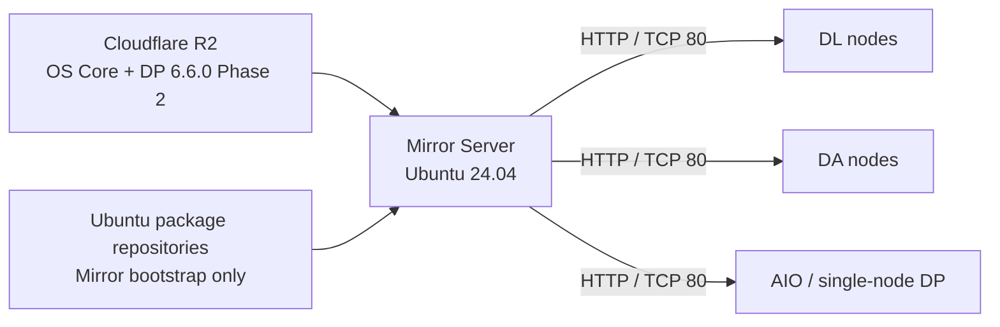

<h1 align="center">DP Ubuntu Upgrade Mirror Manager</h1>

<p align="center">
  <strong>Stellar Cyber Data Processor를 위한 Offline Upgrade Orchestration.</strong>
</p>

<p align="center">
  하나의 Mirror Server에서 Ubuntu 16.04 → 24.04 업그레이드와 검증된 DP 6.6.0 Phase 2 절차를 준비합니다.
</p>

<p align="center">
  <a href="README.md">English</a> · <strong>한국어</strong> · <a href="https://dpos.xdr.ooo/">사용자/운영 가이드</a>
</p>

<p align="center">
  
  
  
  
</p>

<p align="center">
  <strong>제품/운영 가이드:</strong> <a href="https://dpos.xdr.ooo/">dpos.xdr.ooo</a>
</p>

---

## DP가 Internet에 직접 연결되지 않아도 업그레이드할 수 있습니다

Mirror Manager는 Ubuntu 24.04 기반의 단일 Mirror Server를 준비하고, 검증된 OS Core와 DP 6.6.0 Phase 2 artifact를 내려받습니다.

DP host는 외부 R2/ACPS에 직접 연결하지 않고 **Mirror Server의 HTTP/TCP 80**만 사용합니다.

```text
Ubuntu 16.04
   ↓
Ubuntu 18.04
   ↓
Ubuntu 20.04
   ↓
Ubuntu 22.04
   ↓
Ubuntu 24.04
   ↓
DP 6.6.0 Phase 2
```

## 주요 기능

| 기능 | 설명 |
|---|---|
| **Selective OS Mirror** | 지원되는 LTS upgrade chain에 필요한 package만 준비 |
| **Pinned Phase 2 Artifact** | 검증된 immutable DP 6.6.0 Phase 2 artifact 사용 |
| **Dark-site Delivery** | DP는 local Mirror Server에서만 파일 다운로드 |
| **Guided Workflow** | Configuration → Download → HTTP → Readiness → DP 명령 순서 제공 |
| **Cluster Support** | 저장된 DL/DA worker 정보로 master/worker 절차 생성 |
| **Operator Safety Step** | Precheck, service pause, powered-off snapshot/checkpoint는 운영자가 반드시 수행하며, application이 직접 enforce하는 gate는 Menu 4 readiness PASS |
| **Retry / Reuse** | 정상 artifact, partial download, OS Core, Phase 2 bundle 재사용 |

## Architecture



## 기본 운영 순서

```text
1  Configuration
2  Download and Prepare Upgrade Files
3  Enable HTTP Distribution
4  Verify Upgrade Readiness
7  Show DP Client Upgrade Commands
```

**Menu 4가 `PASS`가 되기 전에 DP upgrade를 시작하지 않습니다.**

Menu 4 readiness는 software가 직접 enforce하는 gate입니다. DP precheck, service pause, powered-off snapshot/checkpoint는 **runbook/Menu 7에서 요구하는 필수 운영 절차**이지만, software가 generated upgrade command 실행 전에 실제 완료 여부를 독립적으로 검증하는 것은 아닙니다.

DP에서는 Menu 7이 생성한 명령을 사용하고 수동으로 upgrade command를 조립하지 않는 것이 기본 운영 방식입니다.

## 시작

Mirror Server 요구사항:

- Ubuntu 24.04 LTS amd64
- 2 vCPU 이상, 4 vCPU 권장
- 4 GB RAM 이상, 8 GB 권장
- 현재 artifact 기준 100 GB disk
- DP host에서 접근 가능한 stable IPv4
- DP → Mirror Server TCP/80

설치:

```bash
sudo apt-get update
sudo apt-get install -y git

git clone https://github.com/xdr-labs/ubuntu-mirror-automation.git
cd ubuntu-mirror-automation
sudo ./install.sh
```

GUI/TUI를 다시 열 때는 재설치하지 않고 다음을 사용합니다.

```bash
sudo ubuntu-offline-mirror mirror-manager
```

## 안전상 중요한 원칙

DP에서 먼저 precheck를 수행하고 서비스를 Pause한 뒤, **각 VM/node를 power off한 상태에서 hypervisor snapshot/checkpoint를 생성**합니다. Snapshot이 완료된 뒤에 다시 power on하여 upgrade를 진행합니다.

이 프로젝트 자체는 OS 또는 DP runtime rollback command를 제공하지 않으며 recovery 기준은 hypervisor snapshot입니다.

```text
PROJECT_ROLLBACK_SUPPORTED=NO
OS_ROLLBACK_SUPPORTED=NO
DP_RUNTIME_ROLLBACK_SUPPORTED=NO
RECOVERY_METHOD=HYPERVISOR_SNAPSHOT
```

## 상세 문서

- **사용자/운영 가이드:** https://dpos.xdr.ooo/
- [DP Upgrade Mirror Manager](docs/deployment/DP_UPGRADE_MIRROR_MANAGER.md)
- [OS Core Artifact Format](docs/deployment/OS_CORE_ARTIFACT_FORMAT.md)
- [Testing Guide](docs/development/testing.md)
- 영문 README에는 전체 운영 reference가 포함되어 있습니다: [README.md](README.md)

---

<p align="center">
  <strong>Prepare once. Verify before upgrade. Keep the DP isolated.</strong>
</p>
