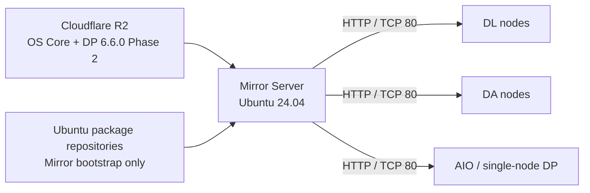

<h1 align="center">DP Ubuntu Upgrade Mirror Manager</h1>

<p align="center">
  <strong>Offline upgrade orchestration for Stellar Cyber Data Processors.</strong>
</p>

<p align="center">
  Prepare one mirror server, upgrade Ubuntu 16.04 → 24.04 safely, then stage and run the validated DP 6.6.0 Phase 2 workflow.
</p>

<p align="center">
  <strong>English</strong> · <a href="README.ko.md">한국어</a> · <a href="https://dpos.xdr.ooo/">User & Operations Guide</a>
</p>

<p align="center">
  
  
  
  
</p>

<p align="center">
  <strong>Product guide:</strong> <a href="https://dpos.xdr.ooo/">dpos.xdr.ooo</a>
</p>

---

## Upgrade a DP without giving it Internet access

The Mirror Manager prepares a single Ubuntu 24.04 mirror server for Stellar Cyber DP upgrades.

The mirror server retrieves the validated OS Core and DP Phase 2 artifacts. DP hosts then download only from the local Mirror Server over HTTP, so the DP itself does not need direct access to Cloudflare R2 or ACPS.

```text
Ubuntu 16.04
   ↓
Ubuntu 18.04
   ↓
Ubuntu 20.04
   ↓
Ubuntu 22.04
   ↓
Ubuntu 24.04
   ↓
DP 6.6.0 Phase 2
```

## What it does

| Capability | What it provides |
|---|---|
| **Selective OS mirror** | Prepares only the Ubuntu packages required for the supported upgrade chain |
| **Pinned Phase 2 artifacts** | Uses the validated immutable DP 6.6.0 Phase 2 artifact set |
| **Dark-site delivery** | DP nodes download from the local Mirror Server over TCP/80 |
| **Guided operations** | Menu-driven Configuration → Download → HTTP → Readiness → DP command workflow |
| **Cluster support** | Generates DL/DA master and worker procedures from saved cluster configuration |
| **Operator safety steps** | Requires the operator to perform DP precheck, service pause, and powered-off snapshot/checkpoint; Menu 4 readiness PASS is the enforced application gate |
| **Retry/reuse** | Reuses valid downloads, partial R2 data, prepared OS Core, and Phase 2 bundles |

## Architecture



The DP side consumes generated commands from the Mirror Manager. Do not construct upgrade commands manually when Menu 7 is available.

## Operator workflow

```text
1  Configuration
2  Download and Prepare Upgrade Files
3  Enable HTTP Distribution
4  Verify Upgrade Readiness
7  Show DP Client Upgrade Commands
```

**Do not start a DP upgrade until Menu 4 reports `PASS`.**

Menu 4 readiness is the tool-enforced gate. The DP precheck, service pause, and powered-off snapshot/checkpoint are **mandatory operator procedures shown by the runbook/Menu 7**, but the software does not independently prove that the operator completed them before a generated upgrade command is run.

For the complete runbook, upgrade path selection, snapshot gate, cluster sequencing, retry behavior, and troubleshooting, use **https://dpos.xdr.ooo/**.

---

## Quick Start

### 1. Prepare the Mirror Server

Use a clean **Ubuntu 24.04 LTS amd64** server.

| Requirement | Minimum / current supported baseline |
| --- | --- |
| CPU | 2 vCPU; 4 vCPU recommended |
| Memory | 4 GB RAM; 8 GB recommended |
| Disk | **100 GB total** for the current artifact set |
| Mirror Server IP | A stable IPv4 address reachable by the DP hosts |
| DP → Mirror Server | TCP **80** |
| Mirror Server outbound | HTTPS to GitHub, Ubuntu package repositories, and `downloads.xdr.ooo` |
| Credentials | No Phase 2 download credentials; Worker SSH password only for clustered bringup |

Current data sizes are approximately:

- Ubuntu OS Core / selective mirror: **3.4 GiB**
- DP 6.6.0 Phase 2 bundle: **28.2 GiB**
- Fresh `Download and Prepare` peak requirement: approximately **70 GiB**, including build overhead and safety reserve

The application performs a free-space preflight before large download/build steps. **100 GB is the validated baseline for the current artifacts, not a promise that every future artifact set will fit.**

### 2. Install

Copy and run:

```bash
sudo apt-get update
sudo apt-get install -y git

git clone https://github.com/xdr-labs/ubuntu-mirror-automation.git
cd ubuntu-mirror-automation
sudo ./install.sh
```

On an interactive terminal, `install.sh` finishes by opening the Mirror Manager GUI.

If the GUI is not open, start it with:

```bash
sudo ubuntu-offline-mirror mirror-manager
```

### 3. Complete the GUI workflow

Run the menu in this order:

```text
1  Configuration
2  Download and Prepare Upgrade Files
3  Enable HTTP Distribution
4  Verify Upgrade Readiness
7  Show DP Client Upgrade Commands
```

In **Configuration**, set all of the following:

1. **Preparation Mode**
2. **Mirror Server IP**
3. **DL Worker IP addresses**
4. **DA Worker IP addresses**
5. **Worker SSH Password (aella)**
6. **Test R2 Connection**
7. **Save Configuration**

For a DL/DA cluster, set the worker IP lists and one common **Worker SSH Password (aella)**. Leave both worker-IP lists empty for AIO/single-node; the worker password is not required in that case.

The GUI may suggest a detected IP address, but auto-detection is only a suggestion. You must confirm an active IPv4 address that the DP hosts can actually reach.

Do not start the DP upgrade until **Menu 4 — Verify Upgrade Readiness** reports `PASS`. Then use **Menu 7** as the authoritative source for the DP-side commands.

---

## Operational notes

### Moving a prepared Mirror Server to a dark site

If the Mirror Server was fully prepared and tested in an Internet-connected environment, use this procedure after moving it to the dark site:

1. Boot the Mirror Server and configure its final dark-site IP address.
2. Run `sudo ubuntu-offline-mirror mirror-manager`.
3. In **Menu 1 — Configuration**, update the **Mirror Server IP** and save.
4. Run **Menu 2 → Menu 3 → Menu 4 → Menu 7**.
5. Confirm **Menu 4 = PASS**, then use the newly generated **Menu 7** commands on the DP.

Menu 2 reuses the prepared local artifacts and rebuilds the DP client files for the new Mirror Server IP. Do not reuse Menu 7 commands generated before the IP change.

### After an SSH disconnect

If SSH disconnects, reconnect and reopen the existing Mirror Manager:

```bash
sudo ubuntu-offline-mirror mirror-manager
```

Do **not** repeat steps that already completed successfully. Continue from the first incomplete step.

- If Menu 2 is still running, do not start another copy; wait for the existing job to finish.
- If Menu 2 completed with `DOWNLOAD_AND_PREPARE=PASS`, continue with **Menu 3 → Menu 4 → Menu 7**.
- If all required steps were already completed and the Mirror Server IP did not change, no rerun is required. Re-running Menu 4 before the DP upgrade is recommended as a final readiness check.

---

## Choose the correct Preparation Mode

| DP starting state | Preparation Mode | Result |
| --- | --- | --- |
| DP 6.2.x / 6.3.x / 6.4.x on Ubuntu 16.04 | **Full OS Upgrade + Phase 2** | Ubuntu 24.04 + DP 6.6.0 |
| DP 6.5.0 on Ubuntu 16.04 | **Full OS Upgrade + Phase 2** | Ubuntu 24.04 + DP 6.6.0 |
| Supported DP 6.2–6.5 already on Ubuntu 24.04 | **Phase 2 Only** | DP 6.6.0 Phase 2 stage/bringup only |
| Healthy DP 6.6.0 already on Ubuntu 24.04 | Normally no upgrade is required | No change |

The Phase 2 target is fixed at **6.6.0**. Starting DP version is detected on the DP host; it is not entered on the Mirror Server.

---

## Before running commands on a DP

Run the DP precheck first, pause DP services, then **power off each DP VM/node and create a full hypervisor snapshot/checkpoint**. Power it back on only after the snapshot/checkpoint completes, and do not resume DP services before the upgrade.

This project does not provide OS or DP-runtime rollback commands:

```text
PROJECT_ROLLBACK_SUPPORTED=NO
OS_ROLLBACK_SUPPORTED=NO
DP_RUNTIME_ROLLBACK_SUPPORTED=NO
RECOVERY_METHOD=HYPERVISOR_SNAPSHOT
```

Intermediate Ubuntu releases are upgrade steps, not recovery points.

---

## How the system works

```text
Cloudflare R2 ───────> Mirror Server ──HTTP/TCP 80──> DP hosts
```

| Source | Used for | Who connects to it |
| --- | --- | --- |
| Cloudflare R2 | Ubuntu OS Core selective mirror + pinned DP 6.6.0 Phase 2 release | Mirror Server only |
| Mirror Server HTTP | OS-hop and Phase 2 client files | DP hosts |

The project does **not** create a full Ubuntu archive mirror and does **not** use `apt-mirror` for the active upgrade workflow. It keeps one selective OS data set and one final DP 6.6.0 Phase 2 bundle.

---

## Network requirements

The Mirror Server needs outbound HTTPS access to:

- `github.com` / GitHub endpoints needed for the initial clone or later source update
- `https://downloads.xdr.ooo` for the R2 OS Core package and immutable Phase 2 release
- Ubuntu package repositories used by the Mirror Server bootstrap

DP hosts need only:

```text
DP host  --->  http://<MIRROR_SERVER_IP>:80
```

The Mirror Server IP saved in Configuration is embedded into generated client artifacts. Do not hardcode a development/test server address into source code.

---

## What `sudo ./install.sh` does

The installer:

1. Checks Ubuntu 24.04 LTS amd64, root, systemd, and apt
2. Installs required packages such as nginx, whiptail, dialog, curl, and Python
3. Creates mirror directories without formatting disks
4. Installs the runtime under `/usr/local/lib/ubuntu-mirror`
5. Installs the `ubuntu-offline-mirror` command under `/usr/local/bin`
6. Installs the nginx base configuration
7. Opens the GUI when running on an interactive TTY

It does **not** start the large R2 downloads. Those begin only when you run **Menu 2 — Download and Prepare Upgrade Files**.

For non-interactive/CI bootstrap:

```bash
sudo ./install.sh --non-interactive
```

### Reopen versus reinstall

After an SSH disconnect, reopen the existing installation with:

```bash
sudo ubuntu-offline-mirror mirror-manager
```

Do **not** run `sudo ./install.sh` just to reopen the GUI.

After deliberately updating this repository with `git pull`, run `sudo ./install.sh` again to deploy the new runtime. A deliberate reinstall can rebuild/publish client artifacts and invalidate previous HTTP/readiness state, so complete the required GUI steps again when instructed.

---

## Mirror Manager GUI

The main menu is:

```text
Workflow: Configuration → Download → Enable HTTP → Verify Readiness

1 Configuration
2 Download and Prepare Upgrade Files
3 Enable HTTP Distribution
4 Verify Upgrade Readiness
5 Show Current Status
6 View Logs
7 Show DP Client Upgrade Commands
0 Exit
```

A menu item marked `[COMPLETED]` is currently valid. The marker is removed automatically if configuration, artifacts, HTTP service, or readiness state becomes stale.

### 1. Configuration

Required operator inputs:

- Preparation Mode
- Mirror Server IP

Cluster configuration is also entered here once:

- **DL Worker IP addresses** — worker IPs belonging to the DL cluster; do not include the DL master
- **DA Worker IP addresses** — worker IPs belonging to the DA cluster; do not include the DA master
- **Worker SSH Password (aella)** — one common password each cluster master uses to SSH to its workers; required when either worker list is configured

Leave both worker-IP fields empty for a single DP / AIO / master without workers.

Read-only/fixed values:

- Phase 2 target: **6.6.0**
- Phase 2 source: immutable Cloudflare R2 release `validated-20260919`
- OS Core source: Cloudflare R2 in Full mode

Configuration is stored root-owned with mode `600` under:

```text
/etc/ubuntu-mirror/dp-upgrade-mirror.conf
```

Worker SSH credentials are redacted from application logs.

### 2. Download and Prepare Upgrade Files

**Full OS Upgrade + Phase 2**:

- verifies/reuses an existing OS Core selective tree when valid
- otherwise downloads OS Core from R2 and materializes the selective mirror
- downloads/reuses the pinned Cloudflare R2 Phase 2 files
- verifies checksums
- creates one DP 6.6.0 final bundle
- prepares client upgrade artifacts

**Phase 2 Only**:

- skips the R2 OS Core package and all OS-hop mirror preparation
- downloads/reuses only the pinned R2 DP 6.6.0 Phase 2 artifacts

Long checksum and tar operations emit progress/heartbeat messages. Do not assume a several-minute SHA256 operation is hung while those messages continue.

### 3. Enable HTTP Distribution

This is a real nginx enable/validation step, not just a status flag. It validates the prepared layout, installs/enables the nginx site, runs `nginx -t`, starts/reloads nginx, and performs live HTTP checks.

### 4. Verify Upgrade Readiness

This checks the live HTTP files required by the selected mode. Readiness is `PASS` only after all required status and HTTP checks succeed.

Possible readiness states are:

```text
PASS
NOT VERIFIED
NOT READY
FAIL
```

### 7. Show DP Client Upgrade Commands

Menu 7 uses the DL/DA worker lists and Worker SSH Password saved in **Configuration**; it does not ask for worker IPs again.

For clustered Full-mode deployments, **STEPS 0–7 are the common procedure** on every DP node being upgraded. Only STEP 8 is role-specific:

| Steps | Execution target |
| --- | --- |
| **STEP 0–7** | DL master + all DL workers + DA master + all DA workers |
| **STEP 8A** | DL master only |
| **STEP 8B** | DA master only |

- Enter DL worker IPs in Configuration (not the DL master IP)
- Enter DA worker IPs in Configuration (not the DA master IP)
- Use one common Worker SSH Password (aella)
- Run the precheck, pause, powered-off snapshot/checkpoint gate, OS hops, and STEP 7 staging on every node as instructed
- Run **STEP 8A** on the DL master only (uses `DL_WORKER_IPS`)
- Run **STEP 8B** on the DA master only (uses `DA_WORKER_IPS`)
- Never run STEP 8 manually on workers; each master uses `--worker-ips` to start bringup on its own workers

Complete STEP 7 on **all** cluster nodes before starting STEP 8. For an AIO/single-node DP, follow STEP 0–10 on that DP; no `--worker-ips` or `--worker-password` is added.

The generated commands are also saved at:

```text
/var/log/ubuntu-mirror-automation/dp-client-upgrade-commands.txt
```

Use Menu 7 output rather than constructing upgrade commands manually.

---

## DP-side upgrade flow

### Full OS Upgrade + Phase 2

Menu 7 guides the operator through the required sequence, which is conceptually:

1. Run the DP precheck
2. Pause DP services
3. Power off the VM/node, create the recovery snapshot/checkpoint, then power it back on without resuming DP
4. Upgrade Ubuntu one LTS hop at a time:
   - 16.04 → 18.04
   - 18.04 → 20.04
   - 20.04 → 22.04
   - 22.04 → 24.04
5. Stage DP 6.6.0 Phase 2 on **every** DL/DA master and worker (same STEP 7 command)
6. Run STEP 8A on the **DL master only** and STEP 8B on the **DA master only**
7. Resume DP services
8. Verify DP/cluster status

### Phase 2 Only

For a DP already on Ubuntu 24.04, Menu 7 still performs the DP precheck → pause → powered-off snapshot/checkpoint gate before prerequisites and staging. OS-hop commands are skipped; clustered bringup is DL-master (`STEP 5A`) / DA-master (`STEP 5B`) only.

### Ubuntu 22.04 intermediate state

During the Full-mode chain, Ubuntu 22.04 is an intermediate state. On affected DP builds:

- `aella_cli` may not be available
- kubelet 1.19.12 may fail against a newer Docker API
- DP workloads may therefore be stopped temporarily

Do not repair kubelet/Docker just to make the intermediate 22.04 state healthy. Continue the OS upgrade to Ubuntu 24.04; Phase 2 bringup rebuilds the DP runtime.

---

## Disk and filesystem behavior

The current validated layout uses one **100 GB disk including Ubuntu OS and mirror data**.

A separate data disk is optional. If you use one, the following must remain on the **same filesystem** because the build uses hard links and atomic renames:

```text
/var/spool/apt-mirror
/var/spool/apt-mirror/.install-cache
/var/spool/apt-mirror/selective
/var/spool/apt-mirror/dp-phase2
```

The disk preflight is intentionally conservative and reserves at least **10 GiB** of safety space.

For interrupted Phase 2 R2 downloads, the preflight is resume-aware. Some internal compatibility field names still use the historical `ACPS_*` prefix, but production acquisition is R2-only:

```text
Phase 2 R2 total expected bytes
- already completed reusable Phase 2 bytes
- reusable .part bytes
= remaining Phase 2 download growth
```

The final Phase 2 bundle is still budgeted at its full size. Existing reusable data is not counted twice against current free space.

**Do not delete Phase 2 `.part` files just to retry.** They are resume data.

---

## Retry and failure recovery

If a download is interrupted:

1. Reopen the GUI with `sudo ubuntu-offline-mirror mirror-manager`
2. Run **Menu 2 — Download and Prepare Upgrade Files** again
3. Keep existing `.part` files

The workflow supports retry/reuse behavior:

- R2 OS Core partial download data can resume
- Phase 2 R2 partial download data can resume
- completed, release-bound Phase 2 files are reused
- a valid existing OS Core tree is reused
- a valid existing DP 6.6.0 final bundle is reused

If the GUI was closed or SSH disconnected, that alone is **not** a reason to reinstall.

Useful diagnostics:

```bash
sudo ubuntu-offline-mirror mirror-manager
ls -lt /var/log/ubuntu-mirror-automation/
cat /etc/ubuntu-mirror/dp-upgrade-mirror.status
```

---

## HTTP layout

The final HTTP layout is intentionally simple: one selective OS tree, one client directory, and one final Phase 2 version directory.

```text
/ubuntu/
/ubuntu-security/
/offline/
/hops/
/client/
/dp-phase2/6.6.0/release.env
/dp-phase2/6.6.0/dp_bundle_6.6.0-current.tar
/dp-phase2/6.6.0/dp_bundle_6.6.0-current.tar.sha256
```

The word `current` in the Phase 2 **filename** is only part of the client contract name. It is not a `current` symlink or generation directory.

Menu 4 is the authoritative readiness test. For manual troubleshooting, test concrete files rather than relying on the HTTP root directory:

```bash
curl -fsS  http://MIRROR_IP/offline/meta-release-lts >/dev/null
curl -fsSI http://MIRROR_IP/client/dp-offline-upgrade-xenial-to-bionic.sh
curl -fsS  http://MIRROR_IP/dp-phase2/6.6.0/release.env
curl -fsSI http://MIRROR_IP/dp-phase2/6.6.0/dp_bundle_6.6.0-current.tar.sha256
```

In **Phase 2 Only** mode, OS-hop files are not required.

---

## Update the Mirror Manager software

To deploy a newer repository version intentionally:

```bash
cd ~/ubuntu-mirror-automation
git pull --ff-only
sudo ./install.sh
```

After the reinstall, follow the next action shown by the installer/GUI. Existing valid large artifacts are designed to be reused, but workflow state may require HTTP/readiness verification again.

To merely reopen the already-installed GUI, use:

```bash
sudo ubuntu-offline-mirror mirror-manager
```

---

## Design and developer documentation

For the complete user and operations guide, see:

- https://dpos.xdr.ooo/

Detailed design:

- [DP Upgrade Mirror Manager](docs/deployment/DP_UPGRADE_MIRROR_MANAGER.md)
- [OS Core Artifact Format](docs/deployment/OS_CORE_ARTIFACT_FORMAT.md)

Developer testing:

- [Testing guide](docs/development/testing.md)

Full test suite:

```bash
bash tests/run_all.sh
```
